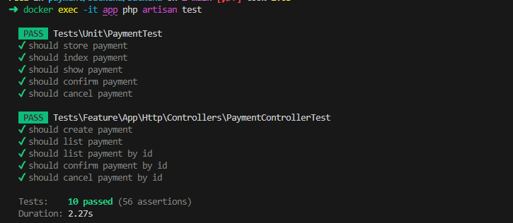
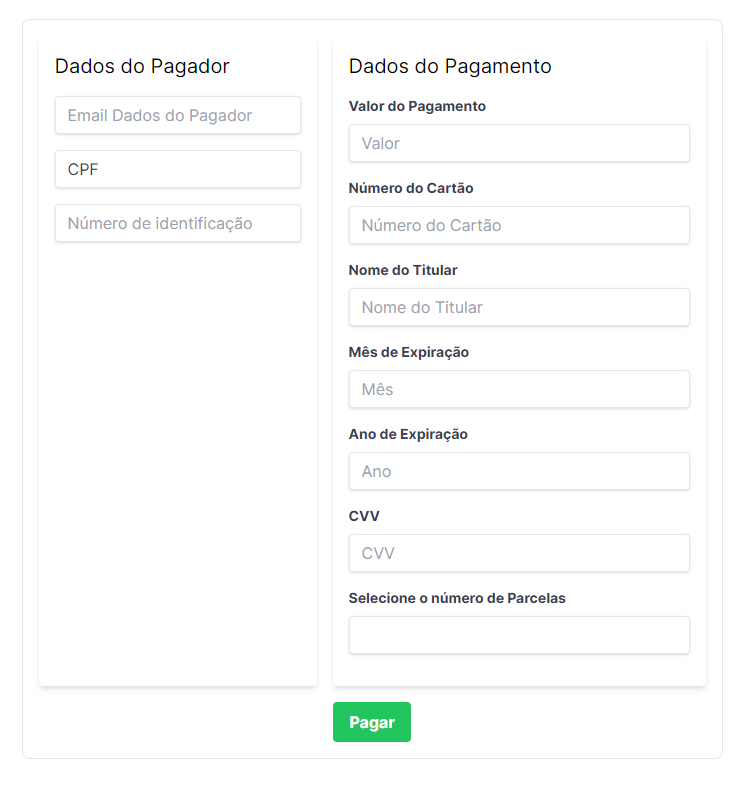

## Getting Started backend

```
PHP: 8.1
Nginx: 1.13
MySQL: 8.0
Laravel: 10
```

#### Prerequisites

Make sure you have Docker and Docker Compose installed on your machine.

[Docker Installation Guide](https://docs.docker.com/get-docker/)

[Docker Compose Installation Guide](https://docs.docker.com/compose/install/)

## Setting Up Docker

To start the Docker containers, navigate to the backend/ directory and execute the following command:

```
cd backend/
cp .env.example .env
docker-compose up -d --build
```

Configuring the Backend Application

1. Navigate to the backend/ directory.
2. Copy the environment file:

```
cp .env.example .env
```

3. Install dependencies:

```
docker exec -it app composer install
```

4. Generate application key:

```
docker exec -it app php artisan key:generate
```

## Database Configuration

Ensure the test database is created. If not, you might need to create it manually:

Hostname: localhost

Username: root

Password: 1234

Execute the following command to create the test database:

```
CREATE DATABASE IF NOT EXISTS payment_test;
```

## Running Tests

Run the tests using the following command:

```
docker exec -it app php artisan test
```



## Getting Started front

First, run the development server:

```
node: 21.6.2
npm: 10.2.4
yarn: 1.22.21
react: 0.1.0
```

## Setting Up frontend

Configuring the Backend Application

1. Navigate to the front/ directory.
2. install depedencies:

```bash
npm install
# or
yarn install
```

3. start front

```bash
npm run dev
# or
yarn run dev
```

Accessing the Local Development Server
Once the server is running, you can access the frontend application at:

```bash
http://localhost:3000
```


